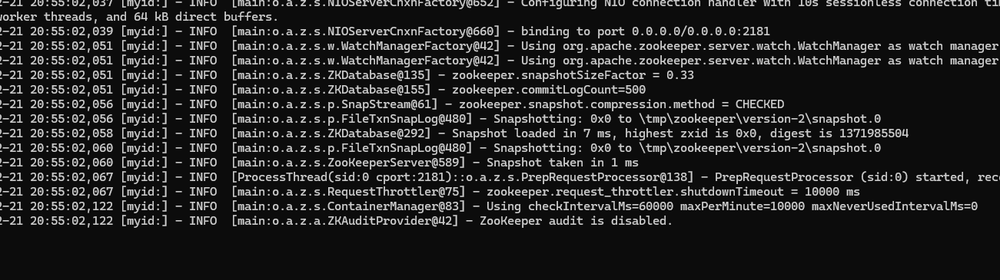

# Отчет по 4 лаборатоной работе

## Zookeeper
- Указал переменную `JAVA_HOME` и запустил Zookeeper

- Создал `ph` и `commit` ветки

## Ход работы

### Проблема обедающих филосовов

Эта проблема возникает, когда группа из 5 (в данном случае) философов собирается вокруг круглого стола, где размещены вилки. Каждый философ должен взять две вилки, чтобы начать есть, но вилки разделяются между соседями. Это может привести к взаимной блокировке, когда каждый философ удерживает одну вилку и ждет, пока другая освободится.

Когда философ должен быть голоден, он вызывает метод `eat()`. Внутри этого метода философ создает временный узел в ZooKeeper `zk.create` для регистрации своего состояния. После этого он пытается получить семафоры левой и правой вилки `leftFork.acquire()` и `rightFork.acquire()`. Если оба семафора доступны, философ берет вилки и трапезничает, выполняя задержку в течение случайного времени. После чего он возвращает вилки на место, используя методы `rightFork.release()` и `leftFork.release()`.

И, наконец, как философ заканчивает есть, он вызывает метод `think()`. Внутри этого метода философ удаляет свой временный узел из ZooKeeper `zk.delete` и выполняет задержку, представляющую фазу размышления.

### Двуфазный коммит протокол

Здесь создается объект класса Coordinator для управления коммитом. Производится запуск coordinatorThread, вызывающий run() в созданном объекте. После чего запусаются рабочие процессы числом numWorkers. Это потоки, которые связываются по указанным хостам и портам с Zookeeper и создается каталог рабочего процесса. В объектах процессов вызываются методы run(), который генерирует случайное значение для голосованя: commit или abort.
Процесс ожидает несколько секунд для того, чтобы быть увенеренным, что Coordinator создан и готов к работе. Затем рабочий процесс отправляет свой голос, используя свой идентификатор и создает временный узел в Zookeeper со своей каталогом и голосом в виде байтового массива. Затем происходит ожидание, эмулирующее время выполнения действия и процесс закрывает связь с сервером Zookeeper.

